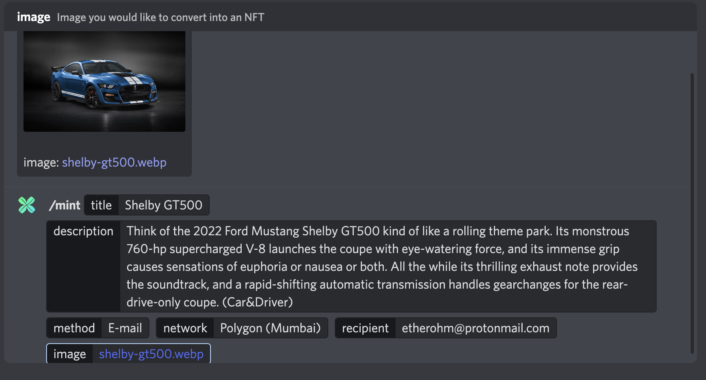
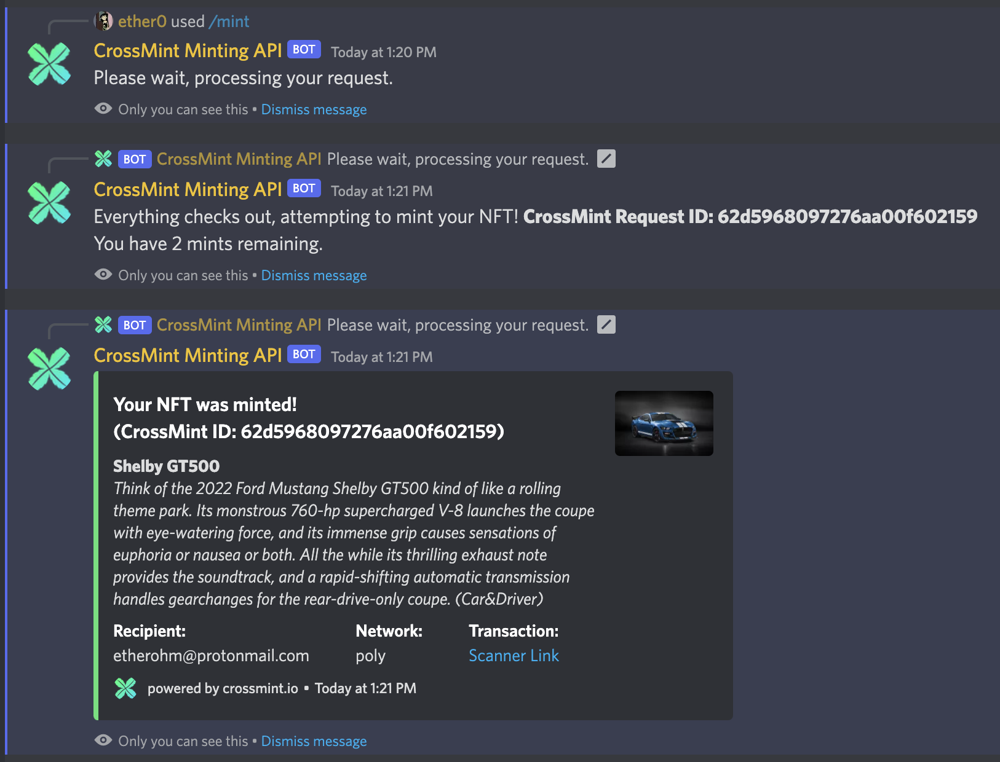
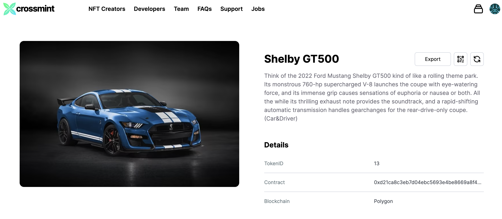
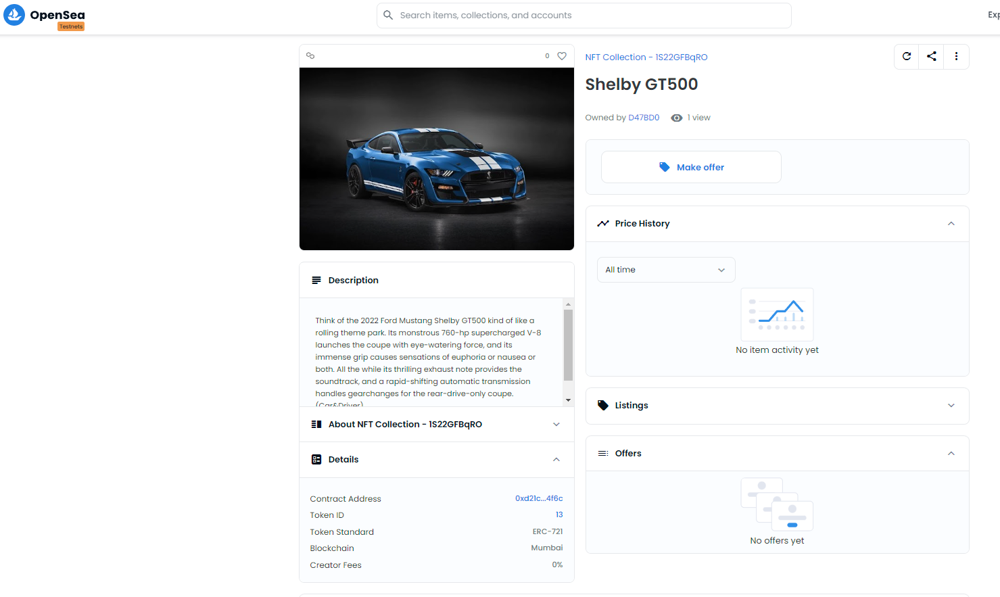
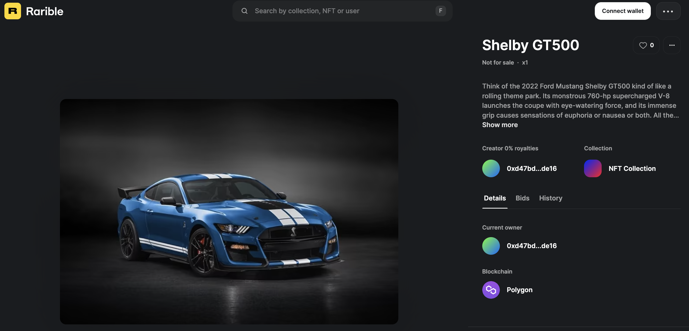

# CrossMint Minting API Bot - Discord
##### Specially crafted for [CrossMint][crossmint] 

## Tech Stack
- NodeJS
- DiscordJS
- CrossMint Minting API

## Implementation Notes
This is a scaled back version of our bot with no database functionality. We highly suggest integrating a database along with the functions to track mints, users and a whole bunch of things! We also suggest not using the provided .json file to store your API keys on a production machine - environment variables are much safer. 

## Functionality
This is a standalone bot that can be implemented in any server and configurable by a single file. The bot aims to make minting easy for the regular user in a fun way; straight from discord! There are some kinks such as paid networks - but free networks this can help with community interaction, have folks come just to make a mint of their dog, house, photo in spain, whatever. 

/mint `title` `description` `method` `network` `recipient` `image` 
**Standard Paramaters:**
- `title`: title of the nft
- `description`: description of the nft
- `method`: gives you options such as web3 and email.
- `network`: select a network for your method. 
- `recipient`: either an address or email.
- `image`: any image you would like to make an NFT.

## Configuration
In the main directory there is a `config.json` folder. Please edit the form to reflect your own parameters. You will need to create a Discord bot on the Discord Developer console. For simplicity we kept fields accessible on this json file but we would like to stress the usage of .env variables for critical tokens and api keys. Finally you'll need an API key and project ID from CrossMint Console. For free mints we use staging @ polygon-mumbai.

If you are not familiar with Discord Apps, please take some time to familiarize yourself with [Discord Dev][discorddev]
If you are not familiar with CrossMint, please take some time to familiarize yourself with [CrossMint][crossmint] 

## How do we run this thing?
First and foremost - you must have Node installed as well as NPM. After this, you can clone or download the project. On the command line, run `npm init` to initialize the project and then `npm i` to install all dependancies. Once you have done that, then run `node index.js &` to run this bot (it will run in the background). If you run into issues with module not found for node:fs, please run `npm i -D @types/node`

## Example Run

But wait - did it *really* mint? 

Yes. Here is the proof: [Transaction][transaction], [OpenSea][opensea], [Rarible][rarible]

**screenshots**

#### Made by ether0 via Internal Hackathon

   [crossmint]: <https://crossmint.io>
   [discorddev]: <https://discord.com/developers/docs/intro>
   [epoch]: <https://www.epochconverter.com/>
   [opensea]: <https://testnets.opensea.io/assets/mumbai/0xd21ca8c3eb7d04ebc5693e4be8669a8f40214f6c/13>
   [rarible]: <https://testnet.rarible.com/token/polygon/0xd21ca8c3eb7d04ebc5693e4be8669a8f40214f6c:13?tab=details>
   [transaction]: <https://mumbai.polygonscan.com/tx/0x991432b3d67cf07ca701e4a21a75c0a243a5705983ea9b953f7557bdcf833b7b>
